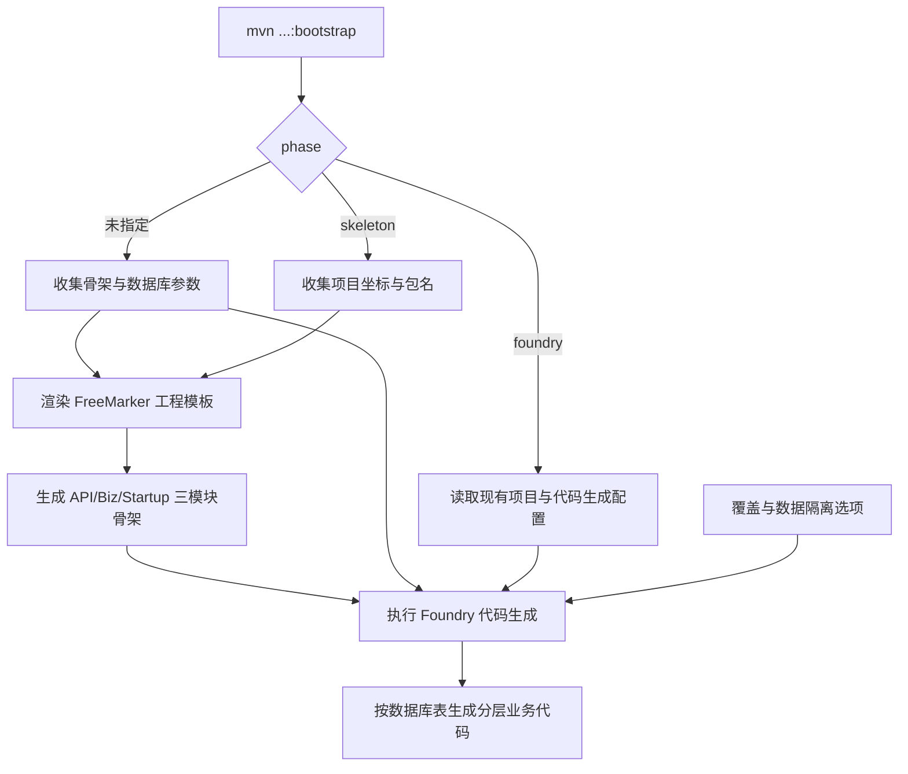

<p align="center">
  
</p>

# g2rain-crafter

[](https://central.sonatype.com/artifact/com.g2rain/g2rain-crafter)
[](LICENSE)
[](https://openjdk.org/)
[](https://maven.apache.org/)

下一代AI软件开发范式，AI原生Agent平台，开源的企业级SaaS底座。

交互式项目骨架与业务代码生成 Maven 插件，通过 bootstrap Goal 编排 skeleton 与 foundry 两个阶段；可创建 API/Biz/Startup 三模块工程，并根据数据库表结构持续生成业务代码；作为平台后端研发支撑层被多个 g2rain 服务复用

[官网](https://www.g2rain.com) · [Issues](https://github.com/g2rain/g2rain/issues) · [Discussions](https://github.com/g2rain/g2rain/discussions)

## 目录

- 项目简介
- 平台定位
- 业务域说明
- 功能概览
- 使用场景
- 核心流程
- 流程图
- 技术栈
- 环境要求
- 快速开始
- 配置说明
- 构建与发布
- 使用示例
- 安全说明
- 与关联仓库的关系
- 模块说明
- 职责边界
- 常见问题
- 关联仓库
- 参与贡献
- 许可证
- 联系我们
- 致谢

## 项目简介

交互式项目骨架与业务代码生成 Maven 插件，通过 bootstrap Goal 编排 skeleton 与 foundry 两个阶段；可创建 API/Biz/Startup 三模块工程，并根据数据库表结构持续生成业务代码；作为平台后端研发支撑层被多个 g2rain 服务复用

## 平台定位

该仓库位于 g2rain 后端研发工具链的工程创建入口：向下复用 g2rain-generator-maven-plugin 的数据库代码生成能力，向上通过 bootstrap Goal 创建符合平台约定的 API/Biz/Startup 多模块项目。它既可从零生成骨架，也可进入现有项目按表持续生成业务代码。

## 业务域说明

该仓库聚焦于 `后端项目初始化、工程模板装配与开发支撑`。

核心对象包括：
- API/Biz/Startup 三模块工程
- bootstrap Maven Goal
- codegen.properties
- FreeMarker 工程模板
- 数据隔离代码生成配置
- 数据库表元数据
- 项目骨架配置
- 执行阶段 phase

主要流程包括：
- bootstrap 完整模式下收集骨架与数据库参数、创建工程后继续生成业务代码的流程
- skeleton 模式下校验项目坐标、渲染 FreeMarker 模板并生成三模块工程的流程
- foundry 模式下加载现有 Maven 项目、读取 codegen.properties 或命令行参数并生成业务代码的流程
- 根据租户列、排除表和覆盖开关决定数据隔离代码及目标文件写入行为的流程

## 功能概览

| 能力 | 说明 |
| --- | --- |
| 统一 bootstrap 入口 | 通过唯一的 bootstrap Goal 编排骨架生成和业务代码生成，默认依次执行两个阶段。 |
| 分阶段执行 | 使用 phase=skeleton 只创建项目，或使用 phase=foundry 在现有项目中只生成业务代码。 |
| 标准多模块骨架 | 生成根 POM 以及 API、Biz、Startup 三个模块，并附带启动类、基础配置和代码生成配置。 |
| 模板资源兼容 | SkeletonGenerator 同时支持从开发文件系统和已发布 Jar 读取模板，渲染 .ftl 文件并复制普通资源。 |
| 数据库业务代码生成 | 复用 g2rain-generator-maven-plugin 的 FoundryGenerator，按表生成后端分层代码。 |
| 多来源配置 | 支持命令行参数、codegen.properties 和交互式控制台输入，并以显式命令行值优先。 |
| 安全写入与数据隔离 | 通过 tables.overwrite 控制覆盖，并按 tenantColumns、excludeTables 和 withIsolation 决定隔离代码生成。 |

## 使用场景

| 场景 | 说明 |
| --- | --- |
| 从零创建平台后端服务 | 需要快速获得符合 g2rain 约定的 API、Biz、Startup 多模块项目时，执行 skeleton 阶段。 |
| 一次完成建项与首批代码 | 新项目已有数据库表时，不指定 phase，让插件先创建骨架再生成首批业务代码。 |
| 在现有项目追加表代码 | 项目已存在且需要为新增数据库表生成分层代码时，在根目录执行 foundry 阶段。 |
| 自动化或 CI 非交互生成 | 在无控制台环境通过 -D 参数或 config.file 提供全部必填项，稳定复现生成结果。 |
| 为租户表生成隔离代码 | 按租户列识别需要隔离的表，并为指定例外表关闭数据隔离代码生成。 |

## 核心流程

| 流程 | 关键步骤 | 代码线索 |
| --- | --- | --- |
| 完整 bootstrap 流程 | 执行 bootstrap 且不指定 phase → 收集并校验骨架与 Foundry 参数 → 展示执行计划和非密码配置 → 渲染三模块项目骨架 → 基于数据库表生成业务代码 → 输出完成状态 | BootstrapMojo.execute、SkeletonGenerator、FoundryGenerator |
| 项目骨架生成 | 读取 groupId、artifactId、version、package 和 description → 定位 /archetype 模板资源 → 替换 g2rain-example 与 Java 包路径 → 渲染 .ftl 模板并复制普通文件 → 生成根 POM、API/Biz/Startup 模块和 codegen.properties | phase=skeleton、SkeletonConfig、SkeletonGenerator、src/main/resources/archetype/g2rain-example |
| 现有项目业务代码生成 | 在项目根目录执行 phase=foundry → 优先使用显式命令行参数并补充读取 config.file → 校验包名、数据库和表参数 → 构造 FoundryConfig 并设置 stepIn → 按表生成分层业务代码 | prepareFoundryConfig、loadFoundryConfigFile、validateFoundryConfig、FoundryConfig、FoundryGenerator |
| 覆盖与数据隔离决策 | 读取 tables.overwrite → 读取 withIsolation 和 tenantColumns → 按 excludeTables 排除例外表 → 将配置传给 FoundryGenerator → 覆盖关闭时保留已有文件 | resolveWithIsolation、resolveTenantColumns、resolveExcludeTables、BootstrapMojoConfigTest |

## 流程图



## 技术栈

| 类别 | 说明 |
| --- | --- |
| 运行时 | Java 25 |
| 插件框架 | Maven Plugin API、maven-plugin-annotations、bootstrap Goal |
| 工程模板 | FreeMarker、内置 archetype 资源、文件系统/Jar 双读取模式 |
| 代码生成 | g2rain-generator-maven-plugin、JDBC 表元数据、FoundryGenerator |
| 测试 | JUnit 6、Mockito |
| 其他 | Lombok |

## 环境要求

- JDK 25+
- Maven 3.9+
- 使用 foundry 阶段时可访问的 JDBC 数据库及对应驱动
- 数据库账号具备读取目标表结构的权限

## 快速开始

| 步骤 | 命令或位置 | 说明 |
| --- | --- | --- |
| 准备构建环境 | JDK 25+、Maven 3.9+ | 工具组件通常只需要 Java 与 Maven 构建环境。 |
| 查看插件帮助 | `mvn com.g2rain:g2rain-crafter:1.0.7:help` | 确认 Maven 能解析插件并查看 bootstrap Goal 参数。 |
| 生成项目骨架 | `mvn com.g2rain:g2rain-crafter:1.0.7:bootstrap -Dphase=skeleton -Darchetype.groupId=com.example -Darchetype.artifactId=demo-service -Darchetype.package=com.example.demo` | 在当前目录生成标准三模块项目骨架。 |
| 生成业务代码 | `mvn com.g2rain:g2rain-crafter:1.0.7:bootstrap -Dphase=foundry -Dconfig.file=codegen.properties` | 进入生成项目根目录后，根据配置文件为数据库表生成业务代码。 |
| 构建组件 | `mvn clean package` | 执行 Maven 构建，生成可发布或可本地安装的组件产物。 |
| 本地安装 | `mvn clean install` | 安装到本地 Maven 仓库，便于业务工程试用插件目标。 |

版本号以项目构建配置为准，当前识别为 `1.0.7`。

## 配置说明

### 阶段控制

| 配置项 | 说明 |
| --- | --- |
| `phase` | 留空执行 skeleton + foundry；skeleton 只生成骨架；foundry 只生成业务代码。 |

### 项目坐标

| 配置项 | 说明 |
| --- | --- |
| `archetype.groupId / archetype.artifactId / archetype.version / archetype.package / archetype.description` | 控制生成项目的 Maven 坐标、版本、Java 基础包和描述。 |

### 配置文件

| 配置项 | 说明 |
| --- | --- |
| `config.file` | 指定 foundry 配置文件；显式命令行参数优先于配置文件。 |

### 数据库

| 配置项 | 说明 |
| --- | --- |
| `database.url / driver / username / password / tables` | 配置元数据来源及逗号分隔的目标表。密码可选但应安全保管。 |

### 覆盖控制

| 配置项 | 说明 |
| --- | --- |
| `tables.overwrite` | 默认 false；true 时允许覆盖已有生成文件。 |

### 数据隔离

| 配置项 | 说明 |
| --- | --- |
| `data.isolation.withIsolation` | 控制是否为识别出的租户表生成数据隔离相关代码，默认 true。 |

### 租户列

| 配置项 | 说明 |
| --- | --- |
| `data.isolation.tenantColumns` | 逗号分隔的租户列名，默认 organ_id。 |

### 排除表

| 配置项 | 说明 |
| --- | --- |
| `data.isolation.excludeTables` | 即使命中租户列也不生成隔离代码的表，使用逗号分隔。 |

## 构建与发布

| 目标 | 命令 | 产物 | 说明 |
| --- | --- | --- | --- |
| 组件产物 | `mvn clean package` | `g2rain-crafter-1.0.7.jar` | 执行 Maven 标准构建，生成可发布的 Maven 插件产物。 |
| 本地 Maven 安装 | `mvn clean install` | `本地 Maven 仓库产物` | 安装到本地 Maven 仓库，便于业务工程本地验证插件目标。 |

## 使用示例

### 交互式完整生成

在支持 System.console() 的真实终端中直接运行。插件先询问项目骨架参数，再询问数据库与代码生成参数，随后连续执行 skeleton 和 foundry。

```console
mvn com.g2rain:g2rain-crafter:1.0.7:bootstrap
Group ID [required]: com.example
Artifact ID [required]: demo-service
Version [optional, default 1.0.0]: 1.0.0
Base Package [required]: com.example.demo
Description [optional]: Demo service
Database URL [required]: jdbc:mysql://localhost:3306/demo
Driver Class [required]: com.mysql.cj.jdbc.Driver
Username [required]: root
Password [optional]: YOUR_PASSWORD
Table Names [required]: user,product
Overwrite existing files? (y/N, default N): n
```

### 交互式仅生成骨架

只询问项目坐标、基础包和描述。版本直接回车时使用默认值 1.0.0。

```console
mvn com.g2rain:g2rain-crafter:1.0.7:bootstrap -Dphase=skeleton
Group ID [required]: com.example
Artifact ID [required]: demo-service
Version [optional, default 1.0.0]:
Base Package [required]: com.example.demo
Description [optional]: Demo service
```

### 交互式仅生成业务代码

必须先进入包含 pom.xml 的现有项目根目录。密码可直接回车留空，覆盖选项支持 y/yes/true/1 与 n/no/false/0。

```console
mvn com.g2rain:g2rain-crafter:1.0.7:bootstrap -Dphase=foundry
Base Package [required]: com.example.demo
Database URL [required]: jdbc:mysql://localhost:3306/demo
Driver Class [required]: com.mysql.cj.jdbc.Driver
Username [required]: root
Password [optional]: YOUR_PASSWORD
Table Names [required]: user,product
Overwrite existing files? (y/N, default N): n
```

### 查看 bootstrap 参数

查看 bootstrap Goal 的参数、类型和说明。

```bash
mvn com.g2rain:g2rain-crafter:1.0.7:help -Ddetail=true -Dgoal=bootstrap
```

### 完整生成

不指定 phase，先生成项目骨架，再为指定数据库表生成业务代码。

```bash
mvn com.g2rain:g2rain-crafter:1.0.7:bootstrap -Darchetype.groupId=com.example -Darchetype.artifactId=demo-service -Darchetype.version=1.0.0 -Darchetype.package=com.example.demo -Ddatabase.url=jdbc:mysql://localhost:3306/demo -Ddatabase.driver=com.mysql.cj.jdbc.Driver -Ddatabase.username=root -Ddatabase.password=YOUR_PASSWORD -Ddatabase.tables=user,product
```

### 只生成项目骨架

生成根 POM、API/Biz/Startup 模块、启动类和 codegen.properties。

```bash
mvn com.g2rain:g2rain-crafter:1.0.7:bootstrap -Dphase=skeleton -Darchetype.groupId=com.example -Darchetype.artifactId=demo-service -Darchetype.version=1.0.0 -Darchetype.package=com.example.demo -Darchetype.description=DemoService
```

### 使用配置文件生成业务代码

必须在已有 Maven 项目的根目录执行，并从配置文件读取数据库与表参数。

```bash
mvn com.g2rain:g2rain-crafter:1.0.7:bootstrap -Dphase=foundry -Dconfig.file=codegen.properties
```

### 命令行直接生成业务代码

不读取配置文件，直接通过命令行提供 Foundry 所需参数。

```bash
mvn com.g2rain:g2rain-crafter:1.0.7:bootstrap -Dphase=foundry -Darchetype.package=com.example.demo -Ddatabase.url=jdbc:mysql://localhost:3306/demo -Ddatabase.driver=com.mysql.cj.jdbc.Driver -Ddatabase.username=root -Ddatabase.password=YOUR_PASSWORD -Ddatabase.tables=user,product
```

### 覆盖已有生成文件

显式允许覆盖已有生成文件；默认 false，使用前应提交或备份当前修改。

```bash
mvn com.g2rain:g2rain-crafter:1.0.7:bootstrap -Dphase=foundry -Dconfig.file=codegen.properties -Dtables.overwrite=true
```

### 命令行配置数据隔离生成

识别租户表，并排除不应生成隔离代码的表。

```bash
mvn com.g2rain:g2rain-crafter:1.0.7:bootstrap -Dphase=foundry -Dconfig.file=codegen.properties -Ddata.isolation.withIsolation=true -Ddata.isolation.tenantColumns=organ_id,tenant_id -Ddata.isolation.excludeTables=dict_type,config
```

### codegen.properties 示例

将配置保存到项目根目录，并使用 config.file 指向该文件。真实密码不要提交到版本库。

```properties
archetype.package=com.example.demo
database.url=jdbc:mysql://localhost:3306/demo
database.driver=com.mysql.cj.jdbc.Driver
database.username=root
database.password=YOUR_PASSWORD
database.tables=user,product
tables.overwrite=false
data.isolation.withIsolation=true
data.isolation.tenantColumns=organ_id
data.isolation.excludeTables=dict_type,config
```

## 安全说明

| 主题 | 说明 |
| --- | --- |
| 依赖可信边界 | 作为平台共享组件或构建工具，应通过组织 Maven 仓库、版本锁定和发布流程控制依赖来源。 |
| 数据库凭据 | database.password 不应提交到仓库；优先通过本地忽略文件、环境注入或 CI 密钥提供，并限制数据库账号仅可读取生成所需的元数据。 |
| 文件覆盖 | tables.overwrite 默认为 false；设为 true 前应提交或备份工作区，并确认生成范围，避免覆盖手工维护的业务代码。 |
| 执行目录 | foundry 阶段必须在目标 Maven 项目根目录执行；自动化任务应固定工作目录，避免把文件生成到错误位置。 |
| 模板与插件来源 | 项目骨架和业务代码来自插件 Jar 及其生成器依赖，应固定可信版本并审查升级后的模板、依赖和生成差异。 |
| 数据隔离配置 | tenantColumns 和 excludeTables 会影响哪些表生成隔离代码；上线前必须结合真实租户边界复核生成注解与无隔离访问方法。 |
| 生成文件审计 | 代码生成或项目初始化工具会写入工程文件，执行前应确认模板来源、输出目录和覆盖策略。 |

## 与关联仓库的关系

本仓库通过内置 FreeMarker 模板创建 g2rain 标准后端工程，并复用 g2rain-generator-maven-plugin 的 FoundryGenerator 生成数据库业务代码；生成项目会预置 g2rain-common、数据访问与文档 Starter 等平台依赖。

## 模块说明

| 模块 | 职责说明 | 代码线索 |
| --- | --- | --- |
| BootstrapMojo | 暴露 bootstrap Goal，解析 phase，收集与校验参数，并编排 skeleton/foundry 两阶段。 | src/main/java/com/g2rain/crafter/BootstrapMojo.java |
| SkeletonGenerator | 遍历 archetype 模板，在文件系统或 Jar 环境中渲染模板、复制资源并创建目标目录。 | src/main/java/com/g2rain/crafter/generator/SkeletonGenerator.java |
| SkeletonConfig | 保存项目坐标、版本、基础包与描述，并转换为 FreeMarker 模板数据。 | src/main/java/com/g2rain/crafter/config/SkeletonConfig.java |
| 项目骨架模板 | 定义根 POM、API/Biz/Startup 模块、启动类、运行配置、README 和 codegen.properties。 | src/main/resources/archetype/g2rain-example |
| Foundry 集成 | 通过 g2rain-generator-maven-plugin 的 FoundryConfig/FoundryGenerator 按数据库表生成业务代码。 | BootstrapMojo、pom.xml 中的 g2rain-generator-maven-plugin |
| 测试套件 | 验证 Goal 阶段选择、参数优先级、模板渲染、生成配置和异常路径。 | src/test/java/com/g2rain/crafter |

## 职责边界

该仓库主要负责：
- 负责通过 bootstrap Goal 编排项目骨架生成和数据库业务代码生成
- 负责生成 API、Biz、Startup 三模块工程、根 POM、启动类、基础配置和 codegen.properties
- 负责把命令行、配置文件或交互输入转换为生成参数，并控制覆盖与数据隔离代码生成

该仓库默认不负责：
- 不负责创建数据库表、迁移真实数据或验证生成代码的业务语义
- 不保证覆盖已有定制代码的操作可逆；启用 tables.overwrite 前应提交或备份工作区
- 不替代生成后项目的依赖配置、业务开发、测试、部署与安全审计

## 常见问题

| 问题 | 可能原因 | 处理建议 |
| --- | --- | --- |
| 业务工程无法解析依赖 | 组件未发布到当前 Maven 仓库，或 groupId/artifactId/version 配置不一致。 | 检查 Maven 仓库地址、版本号和业务工程 dependencyManagement 配置。 |
| 执行后提示缺少 groupId、artifactId 或 package | 当前是非交互式环境，且 skeleton 必填参数没有全部通过 -D 传入。 | 补充 archetype.groupId、archetype.artifactId 和 archetype.package，或在可交互终端执行。 |
| foundry 提示当前目录没有有效 POM | phase=foundry 在非 Maven 项目根目录执行。 | 切换到包含目标 pom.xml 的项目根目录后重新执行 bootstrap。 |
| 配置文件没有生效 | config.file 路径错误，或同名命令行参数已覆盖配置文件值。 | 检查文件绝对/相对路径和 Load config 日志，并确认 -D 参数优先级。 |
| 无法连接数据库或找不到表 | JDBC URL、驱动、账号或 database.tables 与实际数据库不一致。 | 验证账号可读取表结构，核对驱动类、数据库名和逗号分隔的表名。 |
| 已有文件没有更新 | tables.overwrite 保持默认 false，生成器跳过了已存在文件。 | 先检查 Git 差异；确需重新生成时显式使用 -Dtables.overwrite=true。 |
| 租户表没有生成数据隔离代码 | withIsolation 被关闭、租户列未命中，或表位于 excludeTables。 | 核对 data.isolation.withIsolation、tenantColumns、excludeTables 和真实表字段。 |
| 插件目标执行失败 | 插件参数、模板路径、输出目录或 Maven 生命周期配置不正确。 | 检查插件 goal、configuration、模板资源和构建日志。 |

## 关联仓库

| 仓库 | 协作关系 |
| --- | --- |
| g2rain-common | 复用平台公共规范、通用模型、工具能力或基础依赖约束。 |
| g2rain-generator-maven-plugin | 作为后端工程生成链路的一部分，协同完成代码生成或工程初始化。 |
| g2rain-spring-boot-starter | 复用平台后端 Starter，获得统一自动配置、扩展点和后端集成能力。 |

## 参与贡献

我们欢迎所有形式的贡献：Issue 反馈、文档改进、功能建议与代码提交。

推荐流程：

1. Fork 本仓库。
2. 创建特性分支：`git checkout -b feature/your-feature-name`。
3. 提交更改：`git commit -m "Add some feature"`。
4. 推送分支：`git push origin feature/your-feature-name`。
5. 提交 Pull Request。

代码贡献前请尽量补充必要的测试和文档，并确保构建、测试与静态检查通过。

## 许可证

本项目基于 [Apache 2.0许可证](https://github.com/g2rain/g2rain-crafter/blob/main/LICENSE) 开源。

## 联系我们

- Issues: [GitHub Issues](https://github.com/g2rain/g2rain/issues)
- 讨论: [GitHub Discussions](https://github.com/g2rain/g2rain/discussions)
- 邮箱: g2rain_developer@163.com

## 致谢

感谢所有为 g2rain 项目提交 Issue、代码、文档、建议和使用反馈的开发者们！
